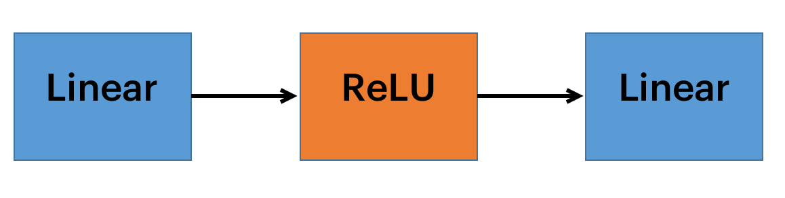

# Transformer
### This project implements very popular architecture which is widely used - Transformer with Multi-head attention mechanism.

## Some optimal hyperparameters to use in NLP tasks
- 6 heads of Multi-head attention (self-attention)
- 6 layers of Encoder
- 6 layers of decoder
- Three hundred dimensional word2vec embeddings

## Feed-forward architecture
This layer may be implemented in different ways depending on model and task. In my implementation it consists of two linear layers and ReLU activation between them.

$$\huge x \Rightarrow y = W_1x + b_1 \Rightarrow z = W_2y + b_2 \Rightarrow z$$

