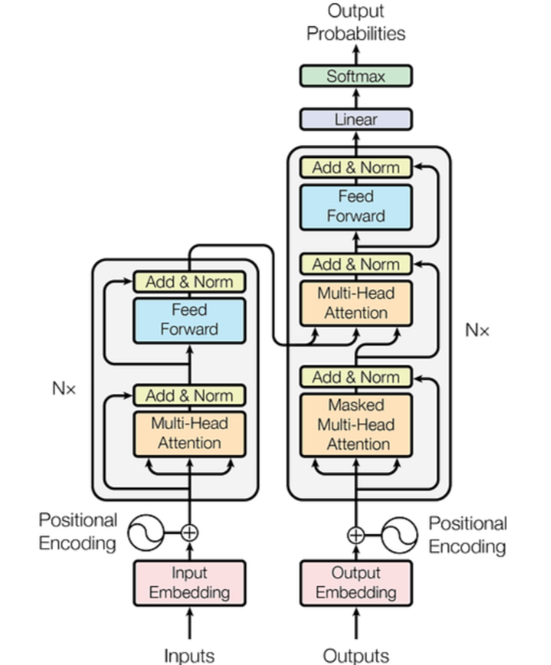

# Transformer
### This project implements very popular architecture which is widely distributed - Transformer with Multi-head attention mechanism.

## Some optimal hyperparameters to use in NLP tasks
- 6 heads of Multi-head attention (self-attention)
- 6 layers of Encoder
- 6 layers of decoder
- Three hundred dimensional word2vec embeddings

  $Wx+b -> ReLU -> Wx+b$
